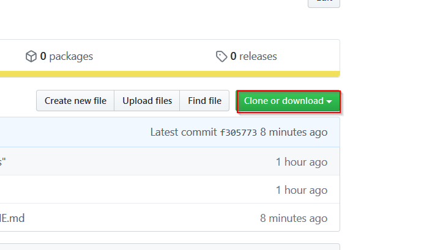

# trello-scripts

---
## Installation Instructions

---
### Install Node.js
The scripts in this project utilize the Node.js runtime, and in order to run them the user will need to do the following:

- Install [Node.js](https://nodejs.org/)

---
### Download the Source Code
- Using Git:
    - Go to the directory where you would like to download the source code to, in a command-line utility
    - Clone the repository:
        ```
        git clone https://github.com/vimal-o-nathan/trello-scripts.git
        ```
- Downloading zip file from Github:
    - In Github, click the 'Clone or download' button:
    
    - Then click the 'Download ZIP' button:
    
    - Extract the zip
    - Copy the extracted folder to the desired location

---
## Setting up REST API Authentication
**trello-scripts** utilizes Trello's REST API in the various scripts contained in the sub-directories of this project. In order to utilize the REST API, you will need to do the following:

1. Create a file names trelloAuthSettings.json_ in this directory, then add the following to this file:
    ```
    {
        "apiKey": "${apiKeyValue}",
        "token": "${token}"
    }
    ```

    * Where:
        * _${apiKey}_ is your Trello Developer API Key retrieved from the following page:
            https://trello.com/app-key
        * _${token}_ is your token retrieved from the "generate a Token" link in the page above (where Developer API Key is retrieved)
    * **DO NOT UNDER ANY CIRCUMSTANCE** commit your API Key and Token to GitHub. trelloAuthSettings.json has been added to the .gitignore file to prevent this.

---
## Setting Up Sub-Projects

In order to utilize one of the sub-projects, please go to the following link:

- [time-scraper](time-scraper)